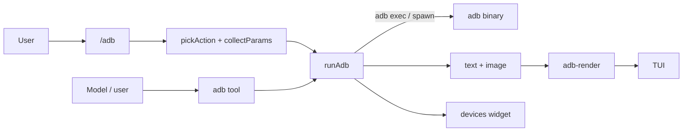

# ADB Extension — control Android devices from Pi

> Outcome: every ADB operation you need while developing Android apps — device connection, APK installs, screenshots the model can see, streamed logs, port forwarding, and recovery commands — runs as a single `adb` tool inside the harness, no terminal juggling. Installed globally, it works in every project without trust prompts.

This extension registers:

- **`adb` tool** — 21 actions the LLM can invoke directly (listed, described, and type-checked via a TypeBox schema).
- **`/adb` command** — interactive picker: choose action → answer prompts → done.
- **`/adb-widget` command** — toggle a persistent widget showing connected devices above the editor.

## Quick path

1. Make sure `adb` (Android SDK Platform Tools) is on your `PATH`.
2. The extension lives in `~/.pi/agent/extensions/adb/` — Pi auto-discovers it globally on startup.
3. Restart Pi or `/reload`.
4. Try it: ask *"list the connected Android devices"*, or run `/adb`.

Expected result: the model calls the `adb` tool, and the TUI renders a formatted device table.

## Installation options

| Scope | Location | Notes |
| :--- | :--- | :--- |
| **Global install (current)** | `~/.pi/agent/extensions/adb/` | Registered in every project, but the `adb` tool is **inactive by default** — enable it per project with `/adb enable`. |
| Project-local | `.pi/extensions/adb/` in a project | Loads only after `/trust` for that project. |
| One-off test | `pi -e ./adb/index.ts` | No discovery; quick iteration. |
| As a package | `pi install git:github.com/<user>/pi-adb` | Once published — see [Sharing](#sharing). |

## Per-project enable/disable

The extension registers one `adb` tool; in non-mobile projects the tool stays inactive (no system-prompt cost). State lives in `~/.pi/agent/adb-extension.json`, keyed by project directory:

| Command | Effect |
| :--- | :--- |
| `/adb enable` | Activates the tool for the current project (persisted). Tab-autocompleted. |
| `/adb disable` | Deactivates it and clears the devices widget (persisted). Tab-autocompleted. |
| `/adb` | Picker; warns and exits if disabled in this project. |

[!NOTE]
Default is **off** everywhere. Projects where you ran `/adb enable` keep working across sessions.

## The `adb` tool — action matrix

| Action | What it does | Required params | Optional params |
| :--- | :--- | :--- | :--- |
| `devices` | List connected devices (long format + commercial names) | — | — |
| `pair` | Pair over Wi-Fi (Android 11+ flow) | `target` = `host:port`, `source` = pairing code | — |
| `connect` | Connect to a paired Wi-Fi device | `target` = `host:port` | — |
| `disconnect` | Disconnect Wi-Fi device(s) | — | `target` = `host:port` (omit = all) |
| `install` | Install an APK | `source` = APK path | `replace` (`-r`), `allowTest` (`-t`) |
| `sideload` | Install an OTA zip in recovery | `source` = zip path | — |
| `uninstall` | Remove a package | `target` = package name | `keepData` (`-k`) |
| `shell` | Run a shell command on device | `command` | — |
| `screencap` | Capture a screenshot | — | — |
| `logcat` | Stream device logs | — | `target` = filter, `clear` (`-c`), `duration` |
| `push` | Copy a local file to the device | `source`, `target` = remote path | — |
| `pull` | Copy a device file to the host | `target` = remote path | `destination` |
| `forward` | Local port → device port | `target` = local spec, `source` = remote spec | — |
| `reverse` | Device port → local port | `target` = remote spec, `source` = local spec | — |
| `list-forward` | List active forwards | — | — |
| `list-reverse` | List active reverse rules | — | — |
| `reboot` | Reboot the device | — | `target` = `system` \| `recovery` \| `bootloader` |
| `root` | Restart adbd with root permissions | — | — |
| `tcpip` | Restart adbd in Wi-Fi mode | — | `target` = port (default 5555) |
| `usb` | Restart adbd in USB mode | — | — |
| `bugreport` | Full bug report (slow) | — | `target` = local output path |
| `ui` | Dump UI hierarchy with tap coordinates | — | — |
| `tap` | Tap the screen | `x`, `y` (device pixels) | — |
| `swipe` | Swipe/scroll | `x`, `y`, `x2`, `y2` | `duration` (ms) |
| `type` | Type into the focused field | `text` | — |
| `key` | Send a key event | `key` (BACK, HOME, ENTER, ...) | — |

**Shared param:** `device` (serial) — see [Smart behavior](#smart-behavior); you rarely need it.

Port specs follow adb syntax: `tcp:8080`, `localabstract:name`, `dev:<device>`, etc.

## Examples

```jsonc
// Interaction loop: see -> locate -> act -> verify
{ "action": "screencap" }                                   // 1. see the screen
{ "action": "ui" }                                           // 2. exact coordinates per node
{ "action": "tap", "x": 540, "y": 2183 }                      // 3. act
{ "action": "screencap" }                                    // 4. verify the result

{ "action": "swipe", "x": 540, "y": 1800, "x2": 540, "y2": 600, "duration": 300 } // scroll
{ "action": "type", "text": "hello world" }                   // into the focused field
{ "action": "key", "key": "BACK" }
```

// Install a debug build, replacing any previous install:
{ "action": "install", "source": "app/build/outputs/apk/debug/app-debug.apk", "replace": true }

// Watch only your app's logs for 30 seconds, clearing the buffer first:
{ "action": "logcat", "target": "Kairos:D", "clear": true, "duration": 30 }

// See the device screen (image is attached to the tool result):
{ "action": "screencap" }

// Typical Wi-Fi workflow, no cable needed after setup:
{ "action": "tcpip" }                                  // switch adbd to TCP/IP
{ "action": "connect", "target": "192.168.1.5:5555" }  // unplug the cable
{ "action": "install", "source": "app-debug.apk", "replace": true }
```

## `/adb` command

Interactive TUI flow (TUI mode only):

1. Pick an action from the list (↑↓ / enter / esc).
2. Answer the prompts for that action — required fields are validated before running; confirms are used for toggles (`-r`, `-t`, `-k`, `-c`).
3. With multiple devices online, pick one from a selector instead of typing a serial.
4. Result is notified, and the devices widget refreshes for `devices` runs.

## `/adb-widget` command

Toggles the persistent devices widget. The widget shows one line per device with a colored status dot (`●` green = online, red = offline, yellow = other) and the model name when available.

[!NOTE]
The widget refreshes on `session_start` and every time a `devices` action runs. Use `/adb-widget` if you want it hidden without touching the session.

## Smart behavior

| Behavior | Detail |
| :--- | :--- |
| **Commercial device names** | `devices` results are enriched via `getprop ro.product.marketname` per device (cached per serial in the session). Shows `Redmi Note 10 5G` instead of forcing you to decode `M2103K19G`. |
| **Serial auto-detection** | With exactly one device online, `-s <serial>` is injected automatically. Skipped for host-level actions (`devices`, `pair`, `connect`, `disconnect`). With 0 or 2+ devices, adb's own error surfaces. |
| **Screenshot as image** | `screencap` → `pull` → base64 PNG block attached to the tool result, so the model can inspect the screen. Local PNG is kept in the temp dir. |
| **logcat streaming** | Spawned process streams output; progress reports every second via partial results; terminates after `duration` seconds (default 10, max 60). Esc aborts cleanly (AbortSignal). |
| **Long-run timeouts** | `shell` 15s, `sideload`/`bugreport` 10 min, everything else 2 min. |
| **Output truncation** | >50KB / 2000 lines is truncated (tail for `shell`, head otherwise) and full output is saved to a temp file referenced in the result. |
| **Abort safety** | Every spawn/exec is bound to the agent's abort signal. |

## Architecture

| Module | Responsibility |
| :--- | :--- |
| `index.ts` | Entry point: registers the tool, `/adb`, `/adb-widget`, `session_start` refresh. |
| `adb-runner.ts` | Action types, `AdbParams`, `buildAdbArgs` (arg construction + validation), output parsers. |
| `adb-exec.ts` | `runAdb` executor, `streamLogcat`, `captureScreenshot`, serial auto-detection. |
| `adb-render.ts` | TUI renderers: device/port tables, call and result rendering. |
| `adb-interactive.ts` | Action catalog, interactive param collection, devices widget. |



Every file respects the project budgets: ≤300 lines, functions ≤50 lines, one responsibility per module.

## Sharing

The directory is package-ready: `package.json` carries the `pi` manifest (`"pi": { "extensions": ["./index.ts"] }`) and the `pi-package` keyword, so publishing is a two-step job:

1. Push this directory to a public git repo (e.g. `github.com/<user>/pi-adb`), fixing the `repository.url` in `package.json`.
2. Anyone can install it with:

```bash
pi install git:github.com/<user>/pi-adb          # latest main
pi install git:github.com/<user>/pi-adb@v0.1.0   # pinned tag
pi install npm:pi-adb                            # if published to npm
```

[!TIP]
No build step is needed — Pi loads extensions through jiti, so plain TypeScript ships as-is. Only add `dependencies` to `package.json` if the extension ever gains runtime imports beyond Node built-ins and `@earendil-works/*` packages.

## Troubleshooting

| Symptom | Fix |
| :--- | :--- |
| Tool silent in a project | Run `/adb enable` in that project. State: `~/.pi/agent/adb-extension.json`. |
| Extension not loaded (global install) | Confirm `~/.pi/agent/extensions/adb/index.ts` exists and `/reload`. Run `pi list` if installed as a package. |
| Extension not loaded (project-local install) | Trust the project (`/trust`) and `/reload`. Project-local `.pi/extensions` load only after trust. |
| `adb: command not found` | Install Android SDK Platform Tools and add to `PATH`. |
| `more than one device` error | Pass `device` (serial) or use `/adb`'s device picker. |
| Screenshot fails in `pull` | Check `adb devices` shows status `device`, not `unauthorized`. |
| logcat output empty | Device may have logs disabled by ROM; try without a filter first. |
| Tool registered twice | A stale single-file `adb.ts` next to the `adb/` directory double-loads; keep only the directory form. |

## Checklist

- [x] All 21 actions consistent across `index.ts`, `adb-runner.ts`, `adb-interactive.ts`.
- [x] No file exceeds 300 lines; no function exceeds 50 lines.
- [x] Every spawn/exec bound to the agent abort signal.
- [x] Errors are thrown with actionable messages.
- [x] Tool metadata (`promptSnippet`, `promptGuidelines`) documents every action.

## Next steps

- Restart Pi and run `/adb` to verify the picker end-to-end.
- To extend: add the action to `AdbAction` + `buildAdbArgs` (runner), a `collectParams` case (interactive), and the `StringEnum`/guidelines (index). One case per action — no other wiring needed.
- To share: push to a git repo and fix `repository.url` in `package.json` (see [Sharing](#sharing)).
